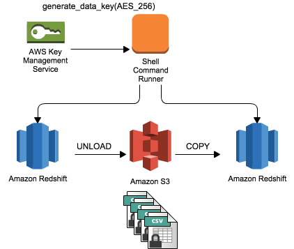

# Amazon Redshift Unload/Copy Utility

The Amazon Redshift Unload/Copy Utility helps you to migrate data between Redshift Clusters or Databases. It exports data from a source cluster to a location on S3, and all data is encrypted with Amazon Key Management Service. It then automatically imports the data into the configured Redshift Cluster, and will cleanup S3 if required. This utility is intended to be used as part of an ongoing scheduled activity, for instance run as part of a Data Pipeline Shell Activity (http://docs.aws.amazon.com/datapipeline/latest/DeveloperGuide/dp-object-shellcommandactivity.html).




## Encryption

The Unload/Copy utility uses the AWS Key Management Servce to encrypt all data that is staged onto S3. A Customer Master Key is created with the ```createKmsKey.sh``` script, and an alias to this key named 'alias/RedshiftUnloadCopyUtility' is used for all references. The Unload/Copy utility then generates an AES_256 Master Symmetric Key which is used to encrypt data on S3, and then used by the target cluster to decrypt files from S3 on load. At no time is this key persisted to disk, and is lost when the program terminates.

## Data Staging Format

Data is stored on Amazon S3 at the configured location as AES 256 encrypted CSV files, gzipped for efficiency. The delimiter is carat '^'. We also add the following options on UNLOAD/COPY fto ensure effective and accurate migration of data between systems:

```
ADDQUOTES
ESCAPE
ALLOWOVERWRITE
```

Data is exported to S3 to the configuration location, plus a date string which allows the data to be tracked over time. A suffix of ```YYYY-mm-DD_HH:MM:SS``` is used.

## Configuration

The utility is configured using a json configuration file, which can be stored on the local filesystem or on Amazon S3. To use Amazon S3, prefix the file location parameter with 's3://'. An example configuration to help you get started can be found in the [example configuration file](example/config.json).

All passwords and access keys for reading and writing from Amazon S3 are encrypted using the Customer Master Key for the utility. Prior to creating the configuration file, you must run ```createKmsKey.sh```, and then use the ```encryptValue.sh``` script to generate the base64 encoded encrypted configuration values. For example, to encrypt the value 'myPassword' with a customer master key stored in Dublin:

```
UnloadCopyUtility meyersi$ ./encryptValue.sh myPassword eu-west-1

CiCUY+94HI56hhvt+IZExFl5Ce47Qrg+ptqCnAHQFHY0fBKRAQEBAgB4lGPveByOeoYb7fiGRMRZeQnuO0K4PqbagpwB0BR2NHwAAABoMGYGCSqGSIb3DQEHBqBZMFcCAQAwUgYJKoZIhvcNAQcBMB4GCWCGSAFlAwQBLjARBAwcOR73wpqThnkYsHMCARCAJbci0vUsbM9iZm8S8fhkXhtk9vGCO5sLP+OdimgbnvyCE5QoD6k=
```

This value is then pasted into the configuration file.

## Running the Utility

The utility takes 2 parameters:

```
<configuration> Local Path or S3 Path to Configuration File on S3"
<region> Region where Configuration File is stored (S3) and where Master Keys and Data Exports are stored
```

For example, to run the utility with a configuration file stored in a bucket in Dublin:

```
python redshift-unload-copy.py s3://my-bucket/my-unload-copy-config.json eu-west-1
```

Please note that the bucket where the configuration is stored, and where the encrypted data is staged in S3 must be in the same AWS Region

## Install Notes

This utility uses PyGreSQL to connect to your Redshift Clusters. To install PyGreSQL (Python PostgreSQL Driver) on Amazon Linux, please ensure that you follow the below steps as the ec2-user:

```
sudo easy_install pip
sudo yum install postgresql postgresql-devel gcc python-devel
sudo pip install PyGreSQL
```